<link rel="stylesheet" href="highlight/styles/default.css">

--- #title x:0 y:0 

<b> Using Django for Genome Engineering </b> 

 Anasstassiya Zidkova, Filip Sedlák 

--- #slide1 x:700 y:-800 scale:0.5

 Most of us like to play cars 

 http://nspt4kids.com/parenting/developmental-skills-while-playing-with-cars/ 

--- #slide2 x:-100 y:-1000 rot:-90

 Some of us like to diassemble cars ... 

 ... in order to study how they work 
  

 http://imgur.com/gallery/DEJwM 

--- #slide3 x:-1000 y:-600 rotx:60 roty:-60 rotz:90

 Can we use the same approach to study living organisms? 

 http://vignette4.wikia.nocookie.net/lesmiserables/images/6/6b/Awww-cute-seal-white-snow.jpg 

--- #slide4 x:-1000 y:400 scale:0.25

Now let's make a short intro into genetics ... 

--- #slide5 x:-1200 y:1000 rot:-45 scale:0.5
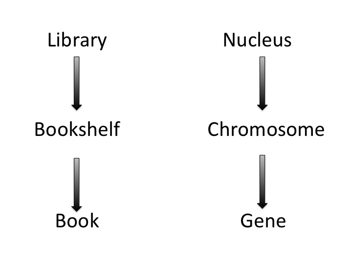

--- #slide6 x:200 y:1000 rot:90 scale:1

    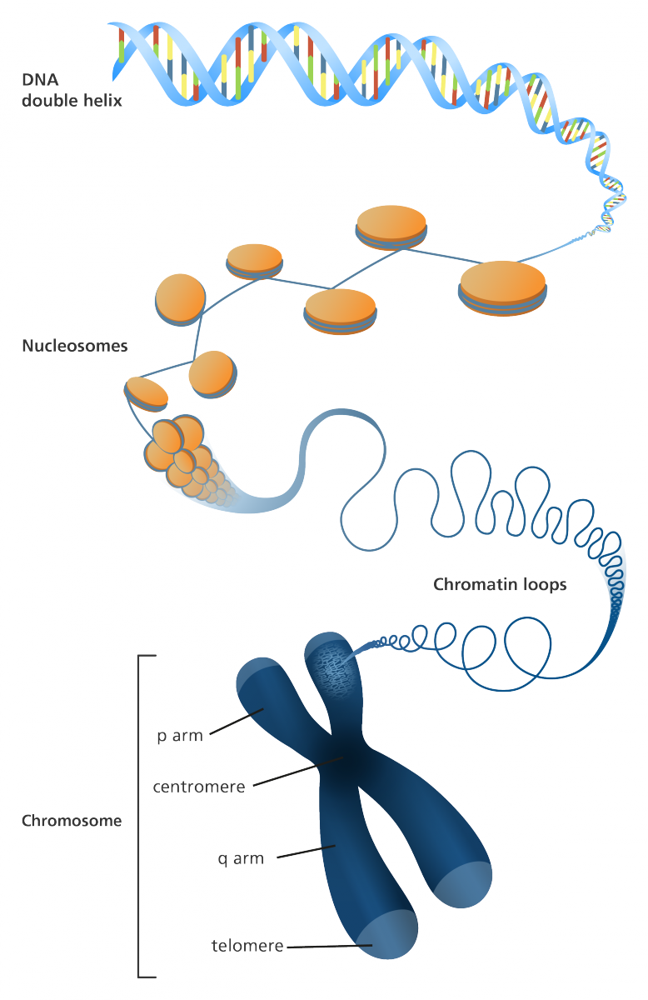
    
 http://www.yourgenome.org/facts/what-is-a-chromosome 

--- #slide7 x:1400 y:1000 z:500 scale:0.5
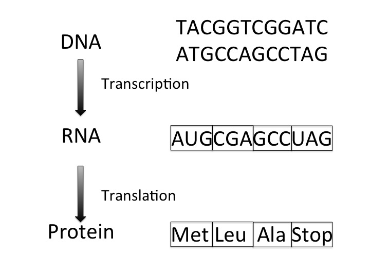

--- #slide8 x:2500 y:500 z:500 scale:0.5

 I remember you! 

</a>

 https://creativemarket.com/microvector/109424-Retro-pointing-finger 

--- #slide9 x:2500 y:-800  scale:1.5

  How it works ... 

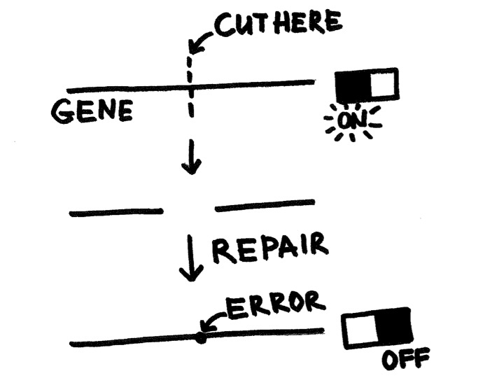

--- #slide10 x:800 y:-1500  rot:45 scale:0.25
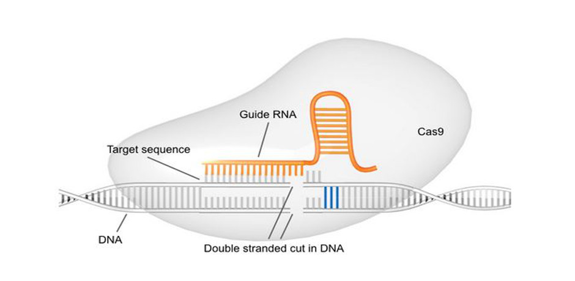

 http://synbiobeta.com/caribou-biosciences-raises-11-million-series-a/ 

--- #slide11 x:-200 y:-1800 z:500 scale:0.5
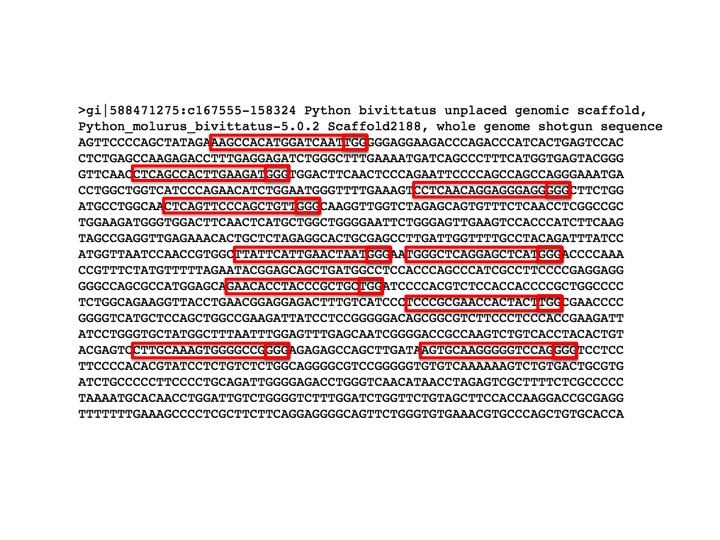

--- #slide12 x:-1200 y:-2000 scale:1 rot:-90
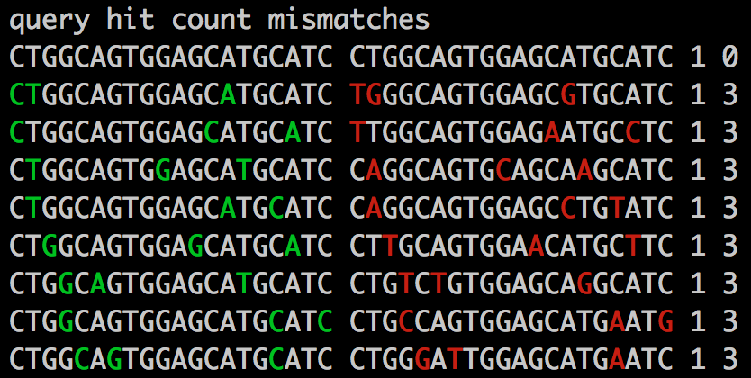

--- #slide13 x:-2000 y:-1200 scale:0.5 rotz:-90
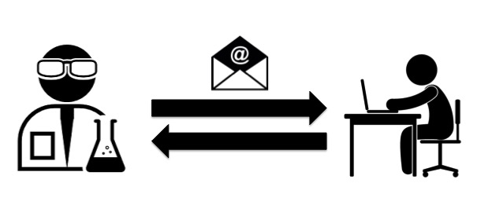

--- #slide14 x:-3500 y:-200 z:500 scale:1
<pre style="font-size:30px" class="centeredCode"><code>
A -> 01000001 -> 00
G -> 01000111 -> 01
C -> 01000011 -> 10
T -> 01010100 -> 11
</code></pre>

--- #slide15 x:-2500 y:1000 z:-500 scale:0.25 rot:30
<pre style="font-size:25px" class="code"><code class="python">
def make_byte(four_letters):
    letters = {
        "A": 0b00, 
        "G": 0b01, 
        "C": 0b10, 
        "T": 0b11
    }
    return sum(
        [letters[letter] << (2 * i) 
            for i, letter 
            in enumerate(four_letters)])
            
            
&gt;&gt;&gt; hex(make_byte("ACTA"))
'0x38'
</code></pre>

--- #slide16 x:-3500 y:1500 z:1000 scale:0.1 rot:-90
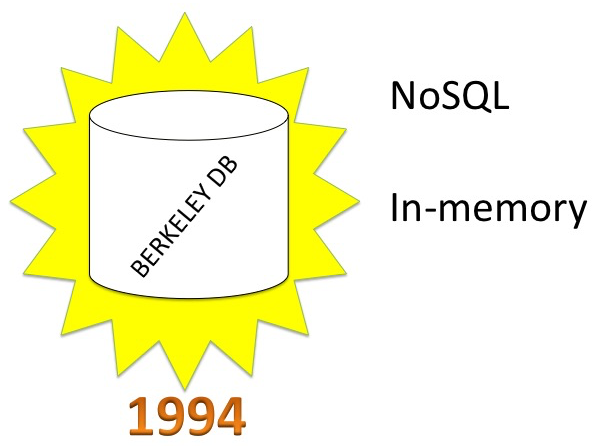

--- #slide17 x:-2500 y:2500 z:1000 scale:0.1 rot:90
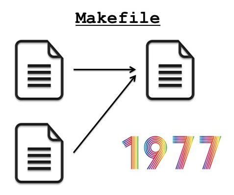

--- #slide18 x:-1500 y:2500 z:500 rot:180 scale:2
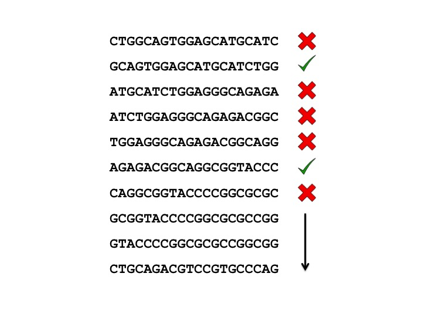

--- #slide19 x:0 y:3500 scale:0.25

--- #slide20 x:1500 y:2500 rotz:90
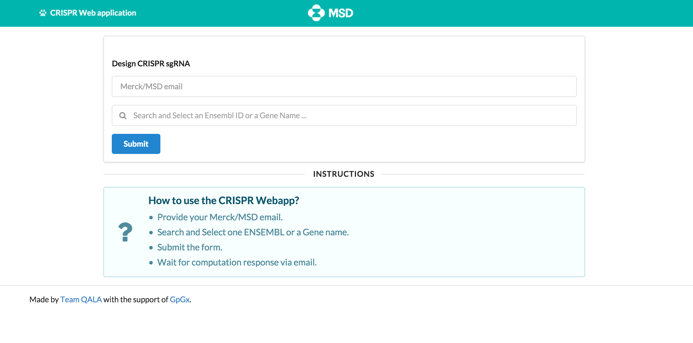

--- #slide21 x:2000 y:1800 z:1000 scale:0.4 rotz:-90

--- #slide22 x:3500 y:3500 z:1000 scale:1 
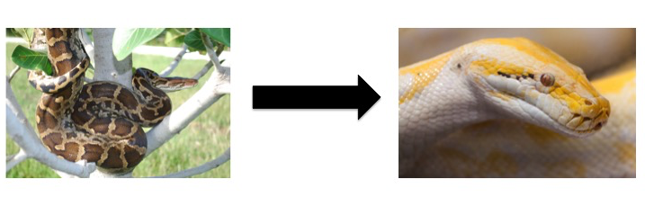

 Wikipedia 

--- #slide23 x:3500 y:2500 z:1000 scale:0.5

 https://heywhatwhatdidyousay.files.wordpress.com/2013/06/happy-scientist.jpg 

--- #slide24 x:3500 y:1500 z:1000 scale:1 rot:360 

 THANK YOU FOR ATTENTION!

